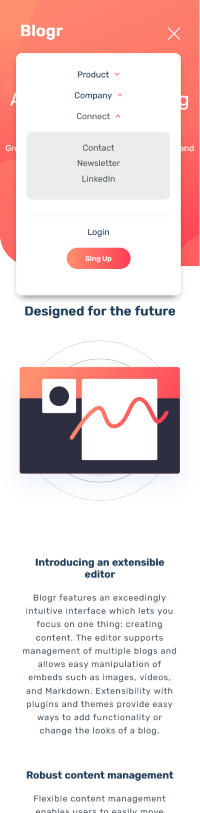

# Frontend Mentor - Blogr landing page solution

This is a solution to the [Blogr landing page challenge on Frontend Mentor](https://www.frontendmentor.io/challenges/blogr-landing-page-EX2RLAApP). Frontend Mentor challenges help you improve your coding skills by building realistic projects. 

## Table of contents

- [Overview](#overview)
  - [The challenge](#the-challenge)
  - [Screenshot](#screenshot)
  - [Links](#links)
- [My process](#my-process)
  - [Built with](#built-with)
  - [What I learned](#what-i-learned)
  - [Useful resources](#useful-resources)

## Overview

### The challenge

Users should be able to:

- View the optimal layout for the site depending on their device's screen size
- See hover states for all interactive elements on the page

### Screenshot

### Links
- Live Site URL: [Add live site URL here](https://semir709.github.io/blogr-landing-page-main/)

## My process

### Built with

- HTML
- CSS
- GRID
- FLEXBOX
- js

### What I learned

It turns out that there is much more for me to understand the overall planning process to write cleaner code.
I got better experience with choosing suitable properties for positioning elements in specific situations.
I got a better understanding of using one class for more different HTML elements.

### Useful resources

- [Kevin Powell](https://www.youtube.com/kepowob) - This helped me better understand positioning and the overall planning process. I'd recommend his youtube channel to anybody who starts learning the front end.